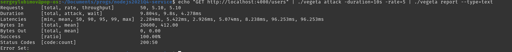
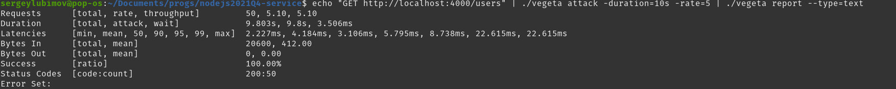

# __Task 10. Nest.js__

Task Description [description here](https://github.com/rolling-scopes-school/basic-nodejs-course/blob/master/descriptions/nestjs.md)

Task Creteria [creteria here](https://github.com/rolling-scopes-school/basic-nodejs-course/blob/master/cross-check/nestjs.md)

Task due date / deadline date - 06.02.22 / 06.02.22 23:59(GMT+3)

Self check:
 
 TOTAL POINTS - **330**

-----------

[summary report](#summary-report)

------------

# __Summary Report__

# Express


# Fastify


## Новый функционал (максимум **90 баллов**)

№ | Description | Points | Status 
--|-------------|--------|-------
1 | Соответствующий POST-запрос на эндпоинт /file позволяет загрузить файл и сохранить его на сервере с приложением | +30 | +30
2 | GET-запрос на эндпоинт /file/:filename позволяет получить загруженный на сервер файл | +30 | +30
3 | Приходящие со стороны клиента DTO валидируются с использованием ValidationPipeline | +30 | +30
4 | **TOTAL POINTS** |   | **+90**

-----

## Особенности реализации (максимум **240 баллов**)

№ | Description | Points | Status 
--|-------------|--------|-------
1 | Guards должны использоваться для работы с авторизацией/аутентификацией | +30 | +30
2 | В приложении должны использоваться модули для разбиения структуры приложения на различные части (User, Board, Task, File) | +30 | +30
3 | Exception filters должны использоваться для обработки исключений в приложении | +30 | +30
4 | Для работы с базой данных должна использоваться ORM, совместимая с Nest.js (@nestjs/typeorm, Prisma, и т.д.) | +30 | +30
5 | Для логирования должен использоваться встроенный Logger или кастомная имплементация | +30 | +
6 | Все внешние зависимости для модулей/классов должны предоставляться с помощью механизма dependency injection | +30 | +30
7 | В зависисимости от переменной окружения USE_FASTIFY Nest.js должен использовать или express или fastify | +30 | +30
8 | Необходимо сравнить производительность Nest.js с использованием express и fastify (можно использовать для этих целей artillery) | +30 | +30
9 | **TOTAL POINTS** |   | **+240**

-----
## Штрафы

№ | Description | Points | Penalty 
--|-------------|--------|--------
1 | Наличие изменений в тестах либо в workflow | -200 | 0
2 | Внесение изменений в репозиторий после дедлайна не считая коммиты, вносящие изменения только в Readme.md | -99 | 0
3 | За __каждую ошибку__ линтера при запуске npm run lint на основе локального конфига минус 10 баллов | -10 | 0
4 | За каждый непроходящий тест npm run test:auth | -20 | 0
5 | За отсутствие отдельной ветки для разработки | -20 | 0
6 | За отсутствие Pull Request | -20 | 0
7 | За неполную информацию в описании Pull Request (отсутствует либо некорректен один из 3 обязательных пунктов) | -10 | 0
8 | Меньше 3 коммитов в ветке разработки, не считая коммиты, вносящие изменения только в Readme.md | -20 |
= | **TOTAL PENALTY** |   | **0**

-----

# Install, run and test

1. Скачиваем репозиторий и запускаем контейнер с базой данных. Скопируйте команды ниже и вствьте в терминал:

```
git clone https://github.com/SeLub/nodejs2021Q4-service.git

cd nodejs2021Q4-service

git checkout task-10

npm install

docker-compose up db

```
2. Откроте дополнительное окно терминала в папке с приложение и запустите сервер командой:

```
npm run start

```
3. Проверьте работу линтера командой:

```
npm run lint

```
4. Запустите тесты командой:

```
npm run test:auth

```

## Screenshots 

------------

#### **Recommended checking process**

