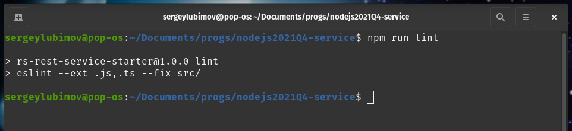

# __Task 5. Typescript basics__

Task [description here](https://github.com/rolling-scopes-school/basic-nodejs-course/blob/master/descriptions/typescript-basics.md)

Task due date / deadline date - 15.11.21 / 19.11.21 23:59(GMT+3)

Self check:
 
 TOTAL POINTS - **330**

-----------

[summaru report](#summary-report)

------------

# __Summary Report__


## Оценка миграции (максимум **260 баллов**)

№ | Description | Points | Status 
--|-------------|--------|-------
1 | За каждый успешно пройденный тест | +10 | +170
2 | В проекте настроен ESLint и имеется правило `no-explicit-any` | +20 | +20
3 | В проекте имеется `tsconfig` и в нем `noImplicitAny: true` | +20 | +20
4 | В проекте имеется `tsconfig` и в нем включена опция [strict](https://www.typescriptlang.org/tsconfig#strict) и при этом strict-related опции не перезаписаны в `false` | +50 | +50
5 | **TOTAL POINTS** |   | **+260**

-----

## Оценка TSDoc (максимум **70 баллов**)

№ | Description | Points | Status 
--|-------------|--------|-------
1 | xxxx | +70
5 | **TOTAL POINTS** |   | **+70**

-----

## Штрафы

№ | Description | Points | Penalty 
--|-------------|--------|--------
1 | Наличие изменений в тестах либо в workflow | -150 | 0
2 | Внесение изменений в репозиторий после дедлайна не считая коммиты, вносящие изменения только в Readme.md и вспомогательные файлы | -99 | 0
3 | Не все файлы с кодом в папке src имеют расширение .ts | -50 | 0
4 | За **каждую** ошибку линтера при запуске `npm run lint` на основе **локального конфига** (именно `errors`, не `warnings`) | -10 | 0
5 | Имеется явно указанный тип `any`, за каждое использование | -20 | 0
6 | За отсутствие отдельной ветки для разработки | -20 | 0
7 | За отсутствие `Pull Request` | -20 | 0
8 | За неполную информацию в описании `Pull Request` (отсутствует либо некорректен один из 3 обязательных пунктов) | -20 | 0
9 | Меньше 3 коммитов в ветке разработки, не считая коммиты, вносящие изменения только в `Readme.md`, либо другие вспомогательные файлы | -20 | 0
= | **TOTAL PENALTY** |   | **0**

-----

# Install, run and test

## Install

To run server just copy commands below and past them to your terminal: 
Server mast start on port 4000

```
git clone https://github.com/SeLub/nodejs2021Q4-service.git

cd nodejs2021Q4-service

git checkout task-5

npm install

npm run start

```

Now, you can test server by Postam

## Run tests

When server is running, you can run tests. Open new window in terminal. 

**Note. Check you are in the root application directory.**

May be you. need next command.
```
cd nodejs2021Q4-service

```

Copy command below and past it to the terminal. 

```
npm run test

```
## Server management

№ | Command | Description 
----------------------|-------------|-----
1 | npm run start | Start server
2 | npm run test | Run tests
3 | npm run lint | Run linter

## Swagger documentation

When server is running, you can check autogenerated API documentation in your brouser:

http://localhost:4000/api-docs/static/index.html

   **Note. This will work only when server is RUNNING**


## Screenshots 

------------

#### **Swagger UI API documentation**


#### **TESTS** - screencast of the tests running


#### **Linter** - result of linter


