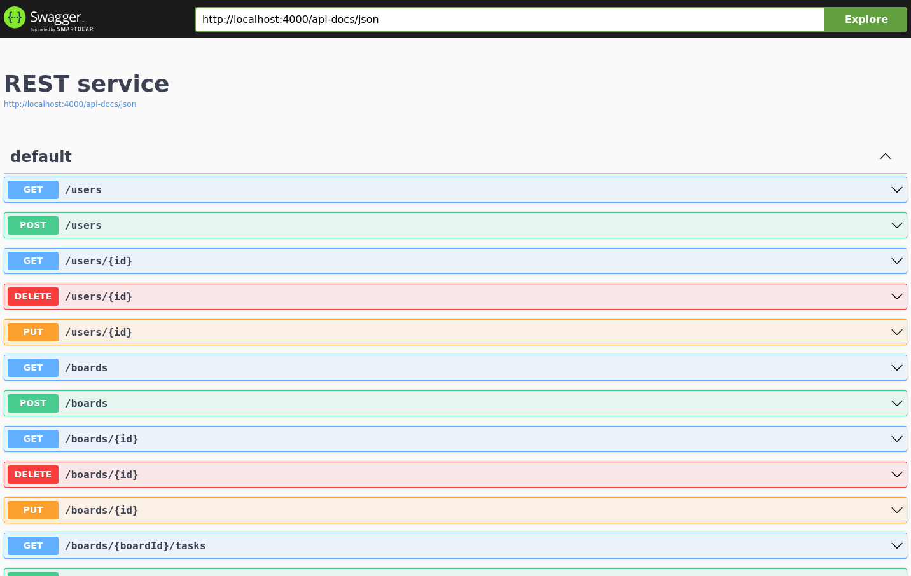
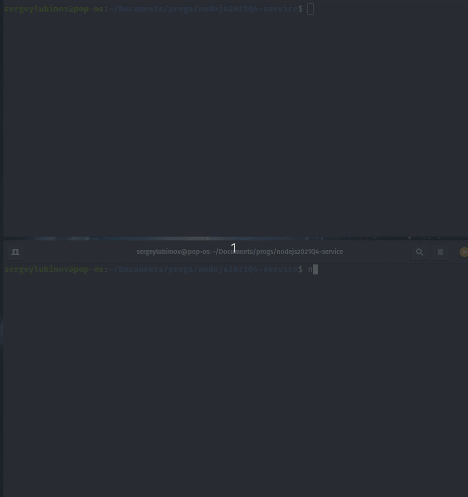

# __Task 3. REST service__

Task [description here](https://github.com/rolling-scopes-school/basic-nodejs-course/blob/master/descriptions/rest-service.md)

Task due date / deadline date - 05.11.21 / 05.11.21 23:59(GMT+3)

Self check:
 
 TOTAL POINTS - **300**

-----------


## Базовая реализация

№ | Description | Points | Status 
--|-------------|--------|-------
1 | Каждый успешный тест при выполнении скрипта `npm run test` | +10 | +170
2 | Код приложения, работающий с сущностью `user` разделен по модулям в соответствии с его назначением (к примеру: работа с запросом и ответом в `*.router.js`, бизнес-логика в `*.service.js`, работа с хранилищем данных в `*.repository.js` и т.п.) | +10 | +10
3 | Аналогично пункту 2 для `boards` | +10 | +10
4 | Аналогично пункту 2 для `tasks` | +10 | +10
5 | **TOTAL POINTS** |   | **+200**

-----

## Продвинутая реализация

№ | Description | Points | Status 
--|-------------|--------|-------
1 | REST сервис построен на базе фреймворка/библиотеки, отличной от Express и Nest.js, либо на чистом Node.js | +100 | +100
5 | **TOTAL POINTS** |   | **+100**

-----

## Штрафы

№ | Description | Points | Penalty 
--|-------------|--------|--------
1 | Наличие изменений в тестах либо в workflow | -150 | 0
2 | Полная ссылка на репозиторий с решением отличается от `https://github.com/%your-gihub-id%/nodejs2021Q4-service` | -100 | 0
3 | Внесение изменений в репозиторий после дедлайна не считая коммиты, вносящие изменения только в `Readme.md` и другую документацию) | -90 | 0
4 | За отсутствие отдельной ветки для разработки | -20 | 0
5 | За отсутствие `Pull Request` | -20 | 0
6 | За неполную информацию в описании `Pull Request` (отсутствует либо некорректен один из 3 обязательных пунктов) | -20 | 0
7 | За **каждую** ошибку линтера при запуске `npm run lint` на основе **локального конфига** (именно `errors`, не `warnings`) | -5 | 0
7 | Меньше 3 коммитов (не считая коммиты, вносящие изменения только в `Readme.md` и другие вспомогательные файлы) | -20 | 0
5 | **TOTAL PENALTY** |   | **0**

-----

# Install, run and test

## Install

To run server just copy commands below and past them to your terminal: 
Server mast start on port 4000

```
git clone https://github.com/SeLub/nodejs2021Q4-service.git

cd nodejs2021Q4-service

git checkout dev

npm install

npm run start

```

Now, you can test server by Postam

## Run tests

When server is running, you can run tests. Open new window in terminal. 

**Note. Check you are in the root application directory.**

Copy command below and past it to the terminal. 

```
npm run test

```
## Server management

№ | Command | Description 
----------------------|-------------|-----
1 | npm run start | Start server
2 | npm run test | Run tests
3 | npm run lint | Run linter

## Swagger documentation

When server is running, you can check autogenerated API documentation in your brouser:

http://localhost:4000/api-docs/static/index.html

   **Note. This will work only when server is RUNNING**


## Screenshots 

------------

#### **Swagger UI API documentation**



#### **TESTS** - screencast of the tests running

