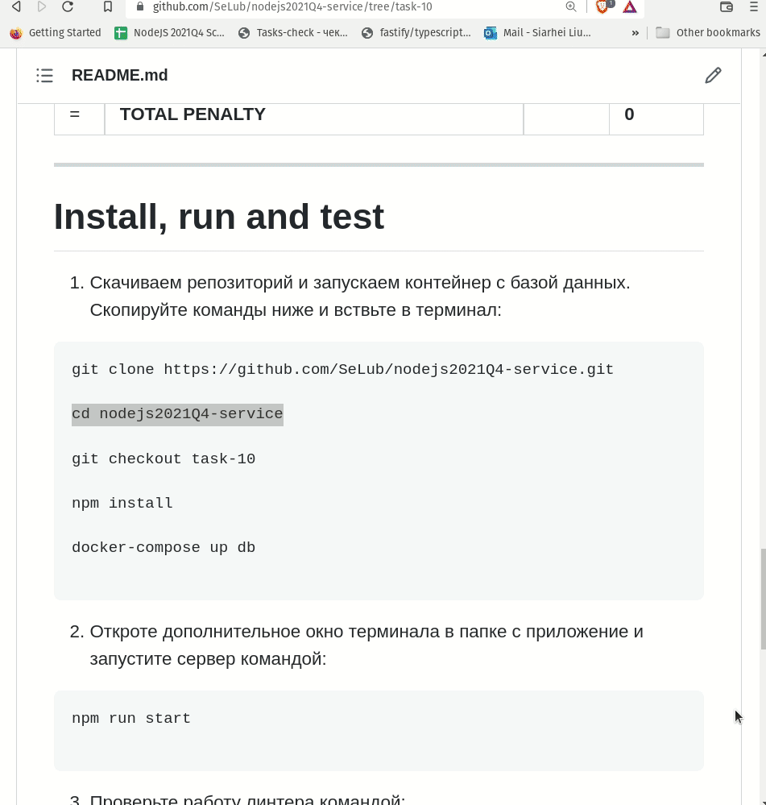

# __Task 6. Logging & Error Handling__

Task [description here](https://github.com/rolling-scopes-school/basic-nodejs-course/blob/master/descriptions/logging-error-handling.md)

Task due date / deadline date - 26.12.21 / 26.12.21 23:59(GMT+3)

Self check:
 
 TOTAL POINTS - **130**

-----------

[summaru report](#summary-report)

------------

# __Summary Report__


## Базовая реализация (максимум **80 баллов**)

№ | Description | Points | Status 
--|-------------|--------|-------
1 | Логирование (как минимум url, query parameters, body) для всех запросов к серверу, а также кода ответа (status code) | +20 | +20
2 | Добавлена централизованная обработка всех ошибок, которая включает отправку респонса с соответствующим кодом http статуса и их логирование | +20 | +20
3 | Добавлены обработка и логирование ошибок на событие uncaughtException | +10 | +10
4 | Добавлены обработка и логирование ошибок на событие unhandledRejection | +10 | +10
5 | Процесс логирования осуществляется единственным модулем (т.е. код, осуществляющий логирование, находится в одном модуле, при этом этот модуль может использоваться внутри других модулей) | +20 | +20
6 | **TOTAL POINTS** |   | **+80**

-----

## Оценка TSDoc (максимум **50 баллов**)

№ | Description | Points | Status 
--|-------------|--------|-------
1 | Логи записываются в файл |   +20  |   +20
2 | Логи ошибок записываются в отдельный файл (либо только в него, либо в дополнение к записи в общий файл)  |   +10 |   +10
3 | Добавить переменную окружения для указания уровня логирования и соотвутствующий функционал |   +20  |   +20
4 | **TOTAL POINTS** |   | **+50**

-----

## Штрафы

№ | Description | Points | Penalty 
--|-------------|--------|--------
1 | Наличие изменений в тестах либо в workflow | -100 | 0
2 | Внесение изменений в репозиторий после дедлайна не считая коммиты, вносящие изменения только в Readme.md и вспомогательные файлы | -39 | 0
3 | За каждый непрошедший тест | -10 | 0
4 | За **каждую** ошибку линтера при запуске `npm run lint` на основе **локального конфига** (именно `errors`, не `warnings`) | -10 | 0
5 | Имеется явно указанный тип `any`, за каждое использование | -20 | 0
6 | За отсутствие отдельной ветки для разработки | -20 | 0
7 | За отсутствие `Pull Request` | -20 | 0
8 | За неполную информацию в описании `Pull Request` (отсутствует либо некорректен один из 3 обязательных пунктов) | -20 | 0
9 | Меньше 3 коммитов в ветке разработки, не считая коммиты, вносящие изменения только в `Readme.md`, либо другие вспомогательные файлы | -20 | 0
= | **TOTAL PENALTY** |   | **0**

-----

# Install, run and test

## Install

To run server just copy commands below and past them to your terminal: 
Server mast start on port 4000

```
git clone https://github.com/SeLub/nodejs2021Q4-service.git

cd nodejs2021Q4-service

git checkout task-5

npm install

npm run start

```

Now, you can test server by Postam

## Run tests

When server is running, you can run tests. Open new window in terminal. 

**Note. Check you are in the root application directory.**

May be you need next command:
```
cd nodejs2021Q4-service

```

Copy command below and past it to the terminal. 

```
npm run test

```
## Run lint

Run next command:

```
npm run lint

```

## Server management

№ | Command | Description 
----------------------|-------------|-----
1 | npm run start | Start server
2 | npm run test | Run tests
3 | npm run lint | Run linter

## TypeDoc documentation

Yo can check generated TSdocs here:

http://localhost:4000/docs/index.html

   **Note. This will work only when server is RUNNING**

To regenerate TSDocs use:

```
npm run build-docs

```

## Swagger documentation

When server is running, you can check autogenerated API documentation in your brouser:

http://localhost:4000/api-docs/static/index.html

   **Note. This will work only when server is RUNNING**


## Screenshots 

------------

#### **Recommended checking process**


