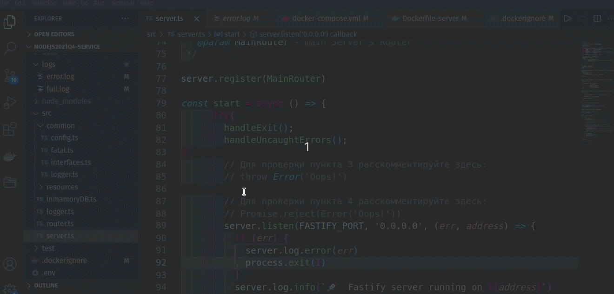
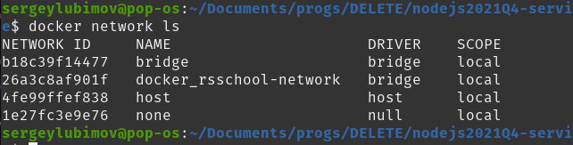
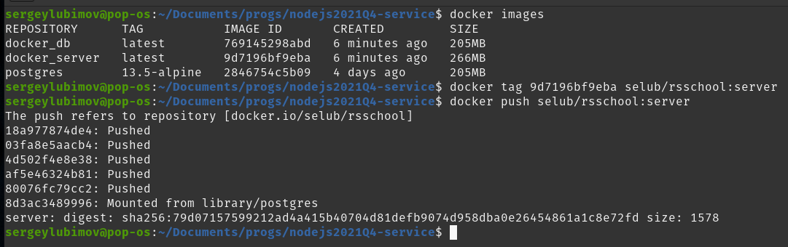
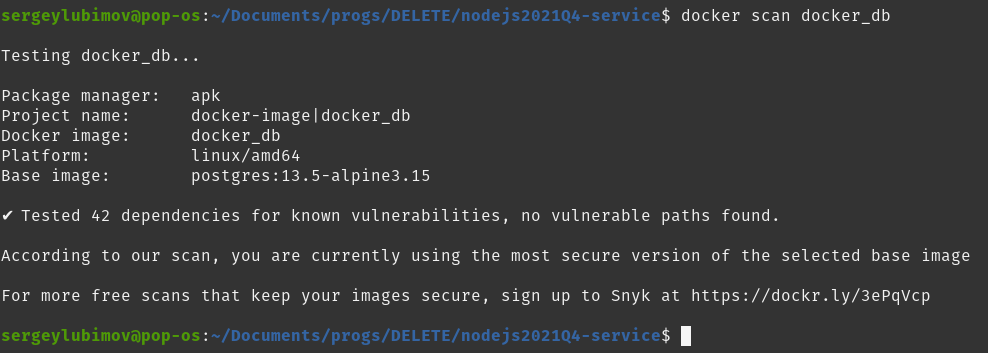
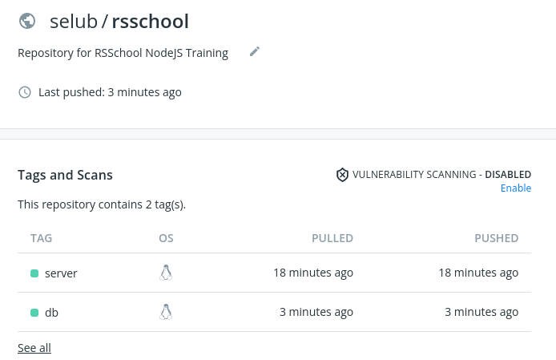

# __Task 8. PostgreSQL & Typeorm__

Task Description [description here](https://github.com/rolling-scopes-school/basic-nodejs-course/blob/master/descriptions/postgresql-typeorm.md)

Task Creteria [creteria here](https://github.com/rolling-scopes-school/basic-nodejs-course/blob/master/cross-check/postgresql-typeorm.md)

Task due date / deadline date - 16.01.22 / 16.01.22 23:59(GMT+3)

Self check:
 
 TOTAL POINTS - **170**

-----------

[summary report](#summary-report)

------------

# __Summary Report__


## Базовая реализация (максимум **120 баллов**)

№ | Description | Points | Status 
--|-------------|--------|-------
1 | В качестве источника данных для __users__ используется PostgreSQL база данных, работа с которой происходит при помощи typeorm | +40 | +40
2 | В качестве источника данных для __tasks__ используется PostgreSQL база данных, работа с которой происходит при помощи typeorm | +40 | +40
4 | В качестве источника данных для boards используется PostgreSQL база данных, работа с которой происходит при помощи typeorm | +40 | +40
5 | **TOTAL POINTS** |   | **+120**

-----

## Продвинутая реализация (максимум **20 баллов**)

№ | Description | Points | Status 
--|-------------|--------|-------
1 | Для создания таблиц с сущностями используются миграции |   +50  |   0
2 | Переменные, используемые для подключения к базе данных, хранятся в __.env__ |   +10  |   +10
3 | Для установления отношений между сущностями используются соответствующие декораторы typeorm |   +10  |   +10
4 | Для проверки задания не требуется локальная установка PostgreSQL, подключение осуществляется к базе данных, работающей в docker контейнере (на основе созданной в предыдущем задании) |   +30  |   +30
5 | **TOTAL POINTS** |   | **+50**

-----

## Штрафы

№ | Description | Points | Penalty 
--|-------------|--------|--------
1 | Наличие изменений в тестах либо в workflow | -150 | 0
2 | Внесение изменений в репозиторий после дедлайна не считая коммиты, вносящие изменения только в Readme.md | -66 | 0
3 | За __каждую ошибку__ линтера при запуске npm run lint на основе локального конфига минус 20 баллов | -20 | 0
4 | За __каждую ошибку__ компилятора | -20 | 0
5 | За __каждый непроходящий тест__ при запуске npm run test | -20 | 0
6 | Имеются явно указанный __тип any__ | -20 | 0
7 | За отсутствие отдельной ветки для разработки | -20 | 0
8 | За отсутствие Pull Request | -20 | 0
9 | За неполную информацию в описании Pull Request (отсутствует либо некорректен один из 3 обязательных пунктов) | -10 | 0
9 | Меньше 3 коммитов в ветке разработки, не считая коммиты, вносящие изменения только в Readme.md | -20 |
= | **TOTAL PENALTY** |   | **0**

-----

# Install, run and test

1. Скачиваем репозиторий и запускаем контейнер с базой данных. Скопируйте команды ниже и вствьте в терминал:

```
git clone https://github.com/SeLub/nodejs2021Q4-service.git

cd nodejs2021Q4-service

git checkout task-8

npm install

docker-compose up db

```
2. Откроте дополнительное окно терминала в папке с приложение и запустите сервер командой:

```
npm run start

```
3. Проверьте работу линтера командой:

```
npm run start

```


## Docker resources

```
.
├── .env <- Dockerfiles and docker-compose get ENV
├── ...
├── logs <- Server in Docker Container writes logs in error.log and full.log
├── db_data <- Database Postgres in Docker Container stores data files here
├── ...
├── .dockerignore <- Deteremine what Docker ignore
├── Dockerfile-server <- Dockerfile for Server application
├── Dockerfile-database <- Dockerfile for Postgres database
├── docker-compose.yml <- Dockerfile for multicontainer app
├── ...
└── README.md <- Documentation and description
```

[_docker-compose.yml_](docker-compose.yml)
```
services:
  server:
    build:
      context: .
      dockerfile: Dockerfile-server
    ...
  db:
    build:
      context: .
      dockerfile: Dockerfile-database
    ...
volumes:
    ...
networks:
    ...
```
The compose file defines an application with two services `server` and `db`.
When deploying the application, docker-compose takes PORTs from .env file and maps port 4000 of the `server` service container to port 4000 of the host as specified in the file. And port 5432 of the `db` service container to port 5432 of the host.

__Make sure port 4000 and 5432 on the host is not already being in use.__

To run server just copy commands below and past them to your terminal: 
Server mast start on port 4000 and container with database on port 5432

```
git clone https://github.com/SeLub/nodejs2021Q4-service.git

cd nodejs2021Q4-service

git checkout task-8

npm install

docker-compose up db

```

Now, you can test server by Postman

# Reports and Screenshots 

------------

## Server Logs

You can find server logs in __logs__ directory. 

## Database Data

To access database data use __db_data__ directory.

## Source code

You can modify server`s code and rebuild server in container on the fly.
Source code of the server you can find in __src__ directory. 



## Docker Network

docker_rsschool-network creat



## Size of images and Dockerhub push



## Docker scan



## Docker hub

Check images __server__ and __db__ in Dockerhub

https://hub.docker.com/r/selub/rsschool/tags


