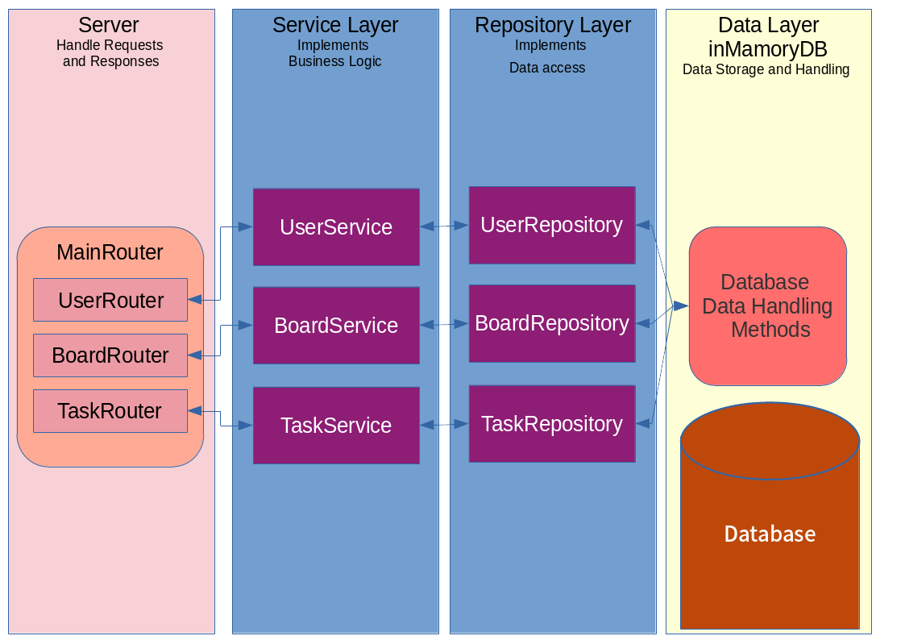
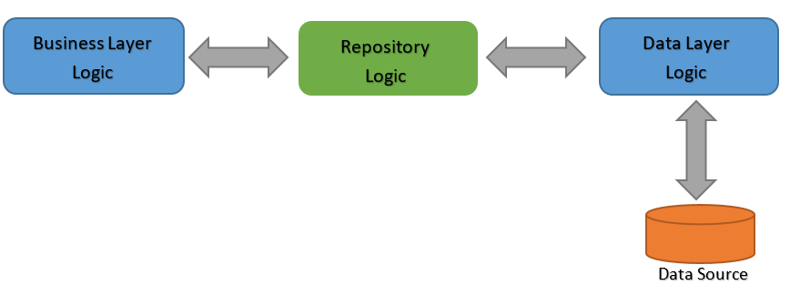

__Description__: This application is an implementation of the Fastify server using TypeScript. The application is a REST service with in-mamory database.
We use the Repository pattern to build the application. Below is a description of each component. The menu contains detailed documentation for each component.

__DATA LAYER__: We define classes __User__, __Board__ and __Task__ for data instancies. To store instancies we define three arrays (for users, boards and tasks accordinly). Module __InMammoryDB__ contains CRUD functions and together with imported arrays constitutes the _data management system_.

__REPOSITORY LAYER__: It is the abstraction layer on the data management system responsible for the implementation of data manipulation. The Layer includes modules __UserRepository__, __BoardRepository__, __TaskRepository__. Each module implements CRUD functionality for each class __User__, __Board__ and __Task__, respectively.

__SERVICE LAYER__: It is the layer implementing business logic of the application. The Layer includes modules __UserService__, __BoardService__, __TaskService__. Each module implements CRUD functionality for each class __User__, __Board__ and __Task__, respectively.

__SERVER__: __Fastify Server__ on __TypeScript__ used as main server. __MainRouter__ is a router of Fastify. It is consists of three parts __UserRouter__, __BoardRouter__ and __TaskRouter__. Фll three use the corresponding module to validate requests: __UserOptions__, __BoardOptions__ and __TaskOptions__. Parameters in requests validate module __Intrefaces__.  

## Repository Pattern

__Description__: The Repository Pattern has gained quite a bit of popularity since it was first introduced as a part of Domain-Driven Design in 2004. Essentially, it provides an abstraction of data, so that your application can work with a simple abstraction that has an interface approximating that of a collection. Adding, removing, updating, and selecting items from this collection is done through a series of straightforward methods, without the need to deal with database concerns like connections, commands, cursors, or readers. 

> You can find documentation here:
> https://github.com/SeLub/nodejs2021Q4-service/tree/task-5